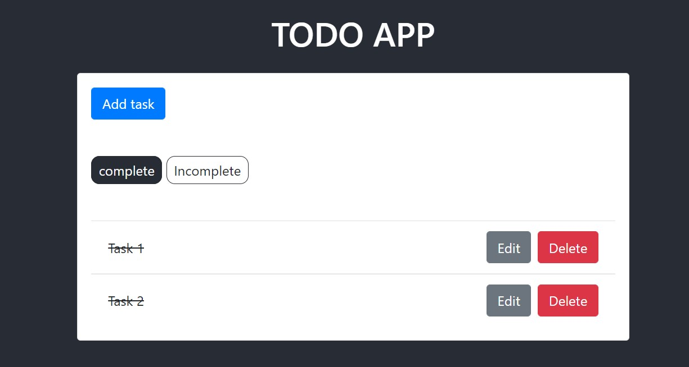
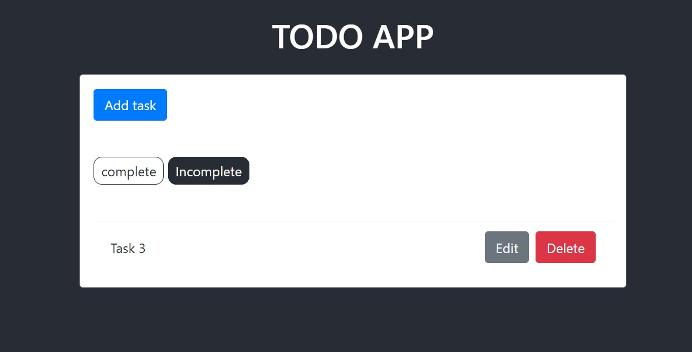
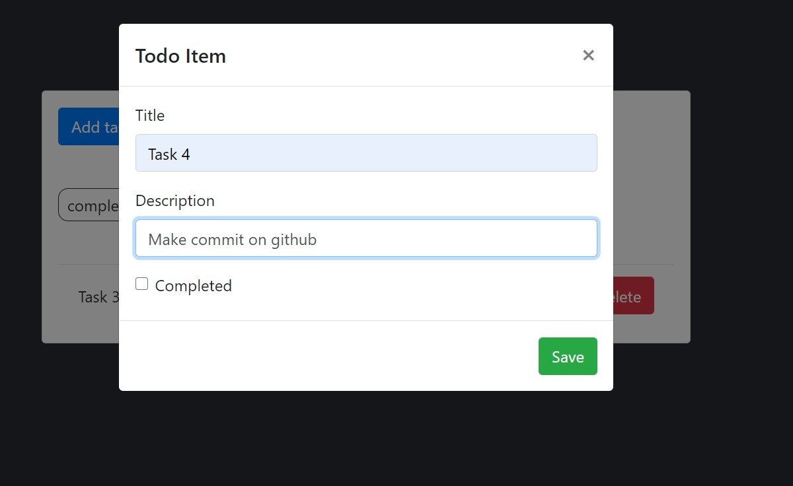
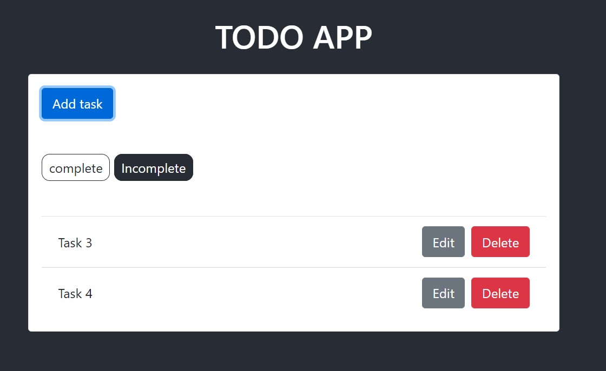
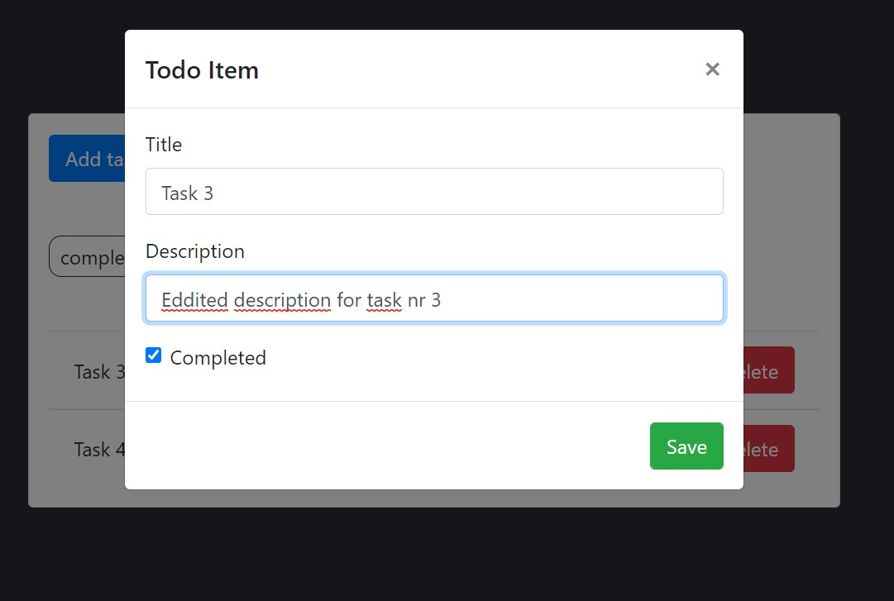
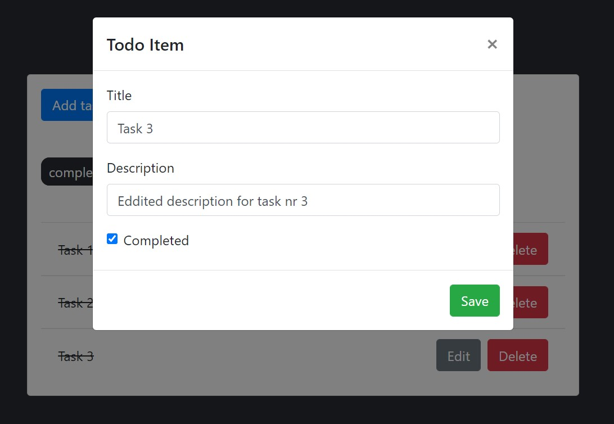
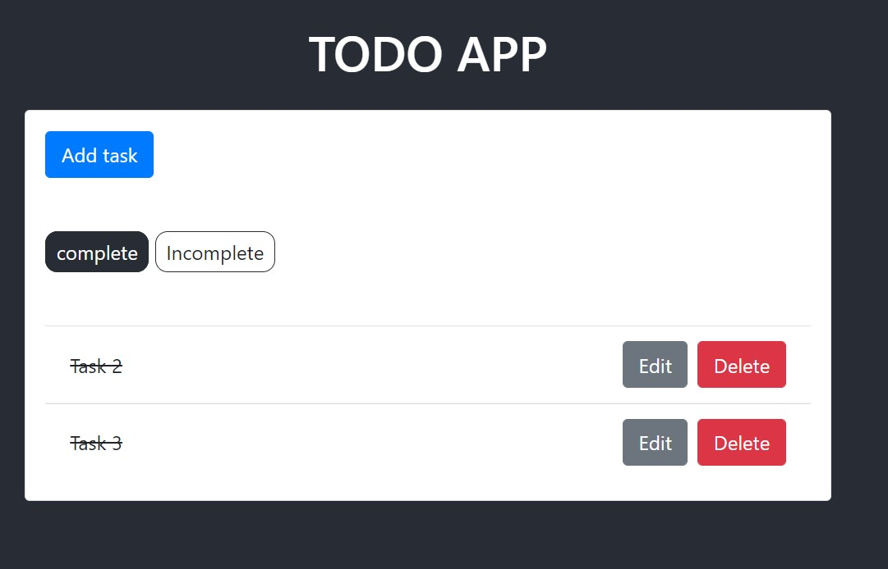

# Aplikacje-Internetowe-Soczynski-185IC

10. Django + React (aplikacja typu ToDo)
- backend napisany w Django,
- frontend napisany za pomocą React.js,
- biblioteka ‘axios’ użyta do “konsumowania” API wystawionego przez DRF,
- przykład aplikacji To-Do z wykorzystaniem Django i React’a,
- należy przeanalizować i wdrożyć kod z ww. poradnika,

Widok strony głównej ToDo - complete

Widok strony głównej ToDo - incomplete

Widok strony głównej ToDo - dodawanie zadania

Widok strony głównej ToDo - dodane zadanie (nie wykonane w sekcji incomplete)

Widok strony głównej ToDo - edytowanie zadania (zmiana opisu i ustawienie statusu jako wykonane)

Widok strony głównej ToDo - widok zedytowanego zadania (zmiana opisu oraz znajduje się w sekcji complete) 

Widok strony głównej ToDo - usuwanie zadania (usunięcie zadania 1)

To run app:
- 2 terminals (active myvenv)
- 1: npm start
- 2: python manage.py runserver