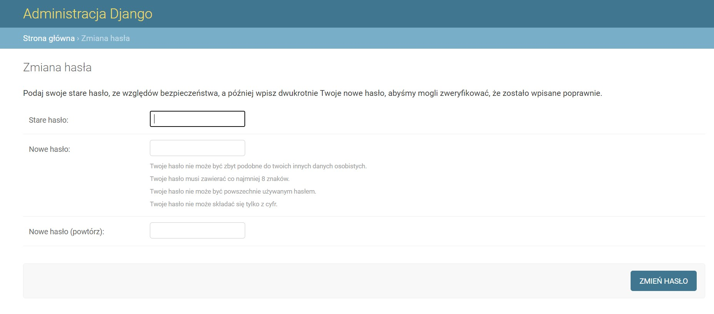

# Aplikacje-Internetowe-Soczynski-185IC

**2. Rejestracja użytkowników**

należy wykorzystać wbudowane widoki uwierzytelniające 
należy zrealizować następujące operacje: 
widoki ‘login’ i ‘logout’ 
widok od zmiany hasła (PasswordChangeView) 
widok od resetu hasła (PasswordResetView) 
do ww. widoku należy użyć ConsoleBackend do wysyłania maili i porobić zrzuty ekranu 
plus za widok realizujący rejestrację usera (signup), 
plus za wrzucenia apki na wybrany PaaS.

Widok "Login"

Widok "Logout"

Widok "Zmiany hasła"

Widok "Pomyślnej zmiany hasła"

Widok "Resetu hasła"

Widok "Potwierdzenia Resetu hasła"

Widok wysłanego maila z "ResetuHasła" do konsoli

Widok "Rejestracji użytkownika"

