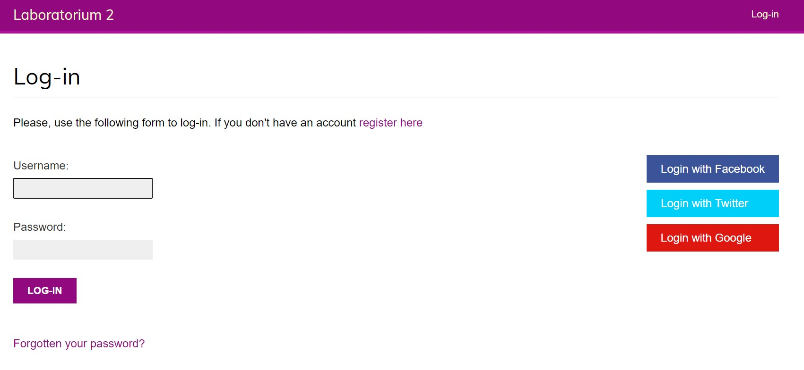
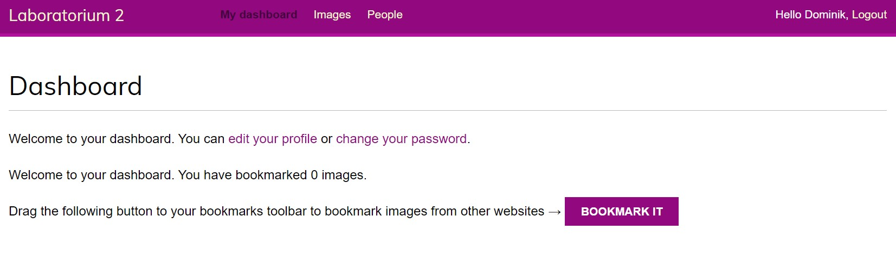
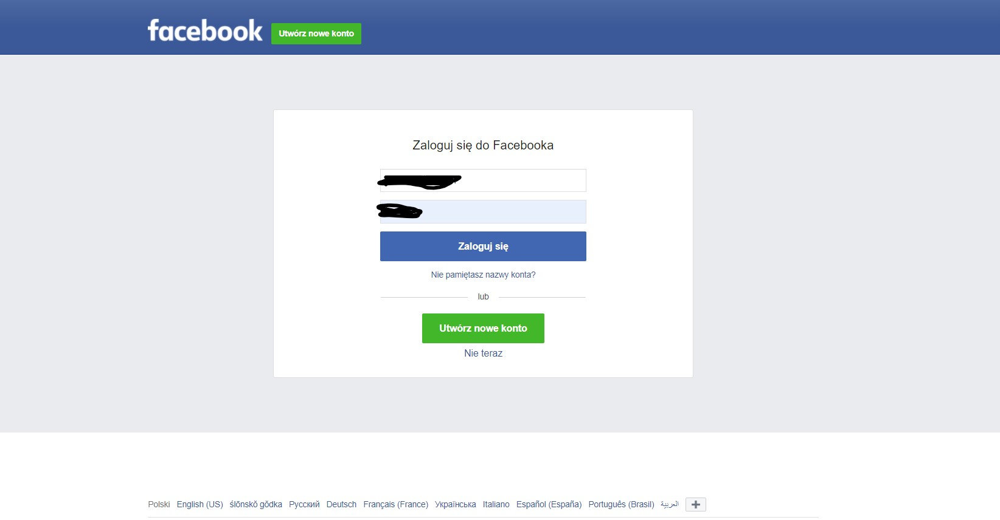
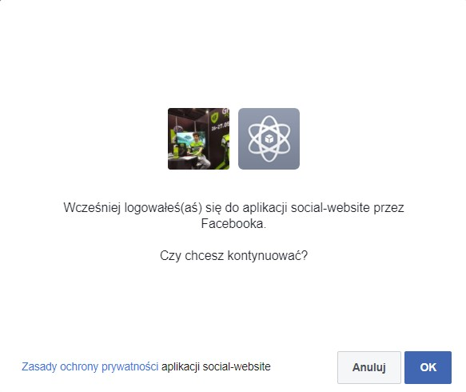
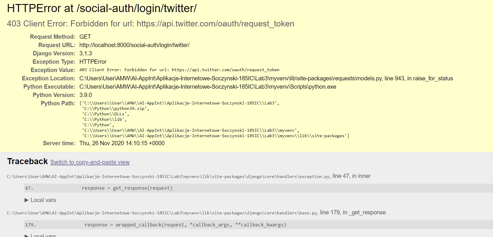

# Aplikacje-Internetowe-Soczynski-185IC

**3. Różne sposoby uwierzytelniania**
uwierzytelnianie przez social media i za pomocą wbudowanych backendów (username lub email), 
należy dodać dwa dowolne backendy uwierzytelniające do listy AUTHORIZATION_BACKENDS (np. Facebook i Twitter), 
konieczne będzie utworzenie aplikacji ww. portalach, 

Widok "Login"

Widok "Dashboard" po zalogowaniu

Widok "Logowania" przez Facebook's

Widok potwierdzenie "Zalogowania" przez FaceBook'a

Widok "Logowania" przez Twetter's
