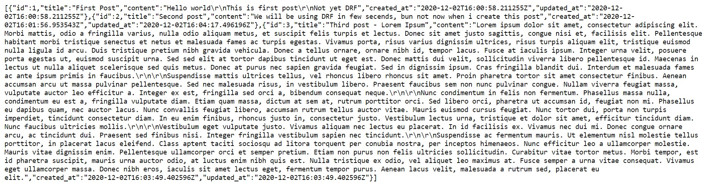

# Aplikacje-Internetowe-Soczynski-185IC

**4. REST API z DRF**

- Django Rest Framework,
- zezwolenia,
- Swagger,
- serializery,
- należy przeanalizować i wdrożyć kod z repozytorium do zajęć,
- plusy za własne przemyślenia, analizę dokumentacji i idące za nimi modyfikacje w projekcie,

Widok strony z "PostList" (widok API)

Widok strony z "PostList" (widok JSON)

Widok strony z "PostDetail" (widok API)

Widok strony z "PostDetail" (widok JSON)

Widok strony z "Swagger'a"

