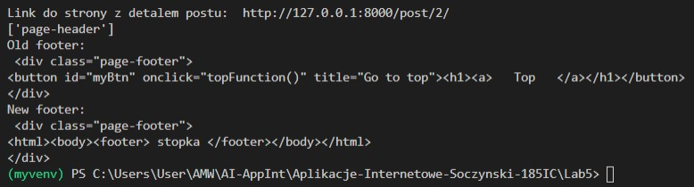

# Aplikacje-Internetowe-Soczynski-185IC

**5. Web Scraping** 
- krótki wstęp do web scrapingu z Pythonem,
- krótki wstęp do web scrapingu z BS4,
- Beautiful Soup,
- XPath i lxml,
- implementacja wyszukiwania elementów do scrapowania za pomocą formularza w Django,

Scrapowanie Postów ze strony stworzonej na Lab1.
Wynik scrapowania w terminalu:

Link do detalu + zmiana wartości w elemencie:

