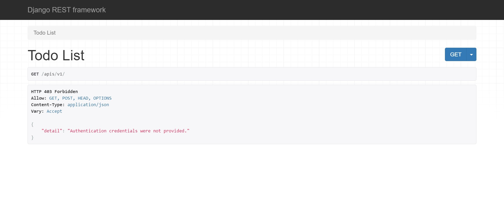
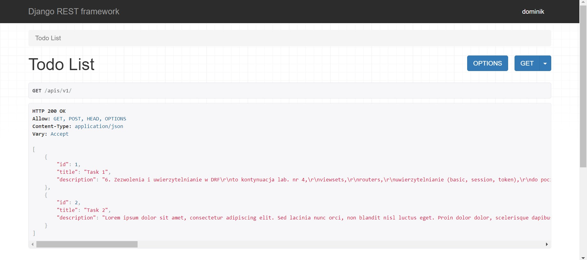
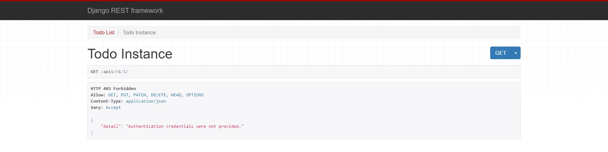
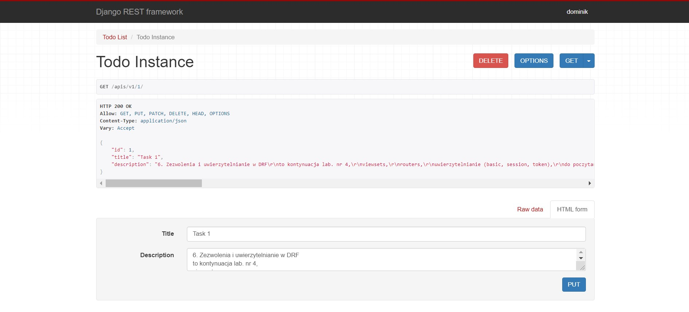
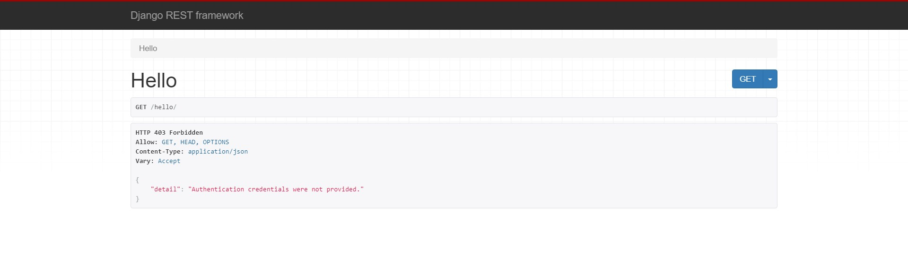
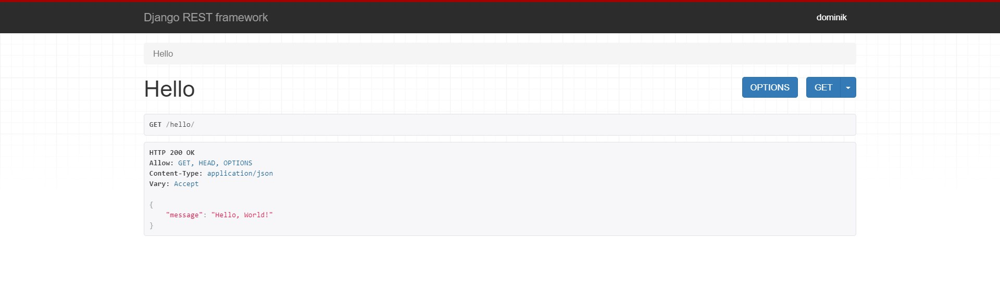

# Aplikacje-Internetowe-Soczynski-185IC

6. Zezwolenia i uwierzytelnianie w DRF
- viewsets,
- routers,
- uwierzytelnianie (basic, session, token),
należy przeanalizować i wdrożyć kod z repozytorium do zajęć,

Widok strony z "Todo list" (widok API) gdy nie jesteśmy uwierzytelnieni

Widok strony z "Todo list" (widok API) gdy jesteśmy uwierzytelnieni

Widok strony z "Todo instance" (konkretne zadanie, widok API) gdy nie jesteśmy uwierzytelnieni

Widok strony z "Todo instance" (konkretne zadanie, widok API) gdy jesteśmy uwierzytelnieni

Strona "Hello" jest testoowa, do sprawdzenia działania zanim dodałem ją do wersji strony z zadaniami "todo"

Widok strony z "Hello" gdy nie jesteśmy uwierzytelnieni

Widok strony z "Hello" gdy jesteśmy uwierzytelnieni
