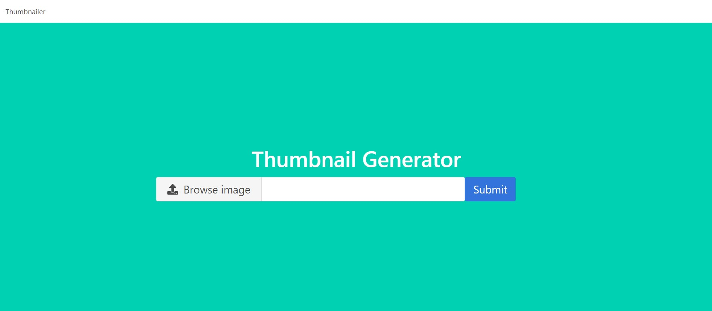

# Aplikacje-Internetowe-Soczynski-185IC

7. Python + Redis + Django

- należy przerobić zadania zawarte w powyższych artykułach i dodać je do swojego repo,
- nie jest konieczna instalacja Redisa za pomocą Dockera, wystarczy standardowa instalacja,
- oprócz instalacji redis-server konieczna jest instalacja pakietu redis poprzez ‘pip’,
- najwygodniej jest podzielić się zadaniami, żeby przyspieszyć pracę z Redisem,
- tutorial o współpracy Python + Redis,
- do przerobienia przykład współpracy Django + Redis + Celery,
- praca z workerami w Celery,
- praca z Celery Beat,

Widok strony głównej - image_parroter

