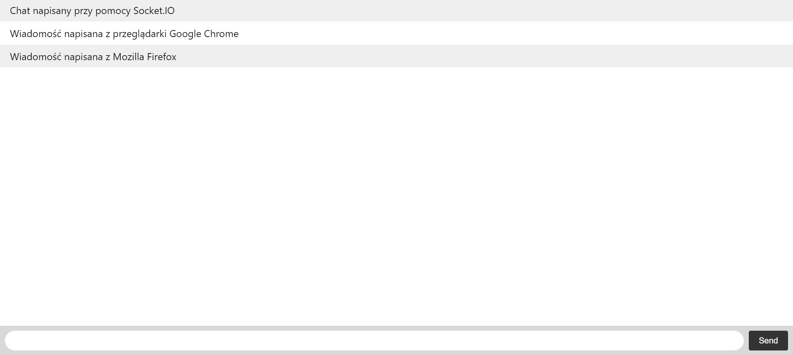
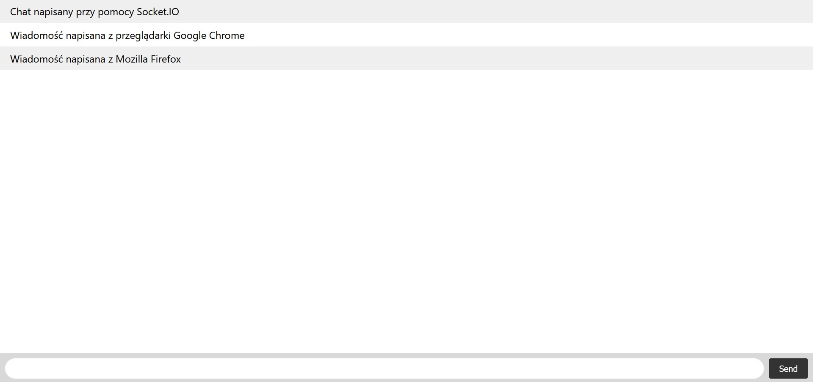
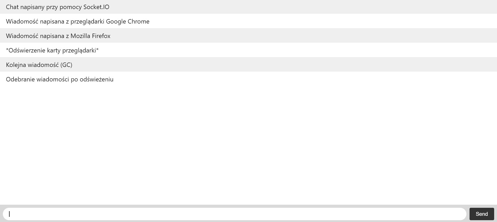
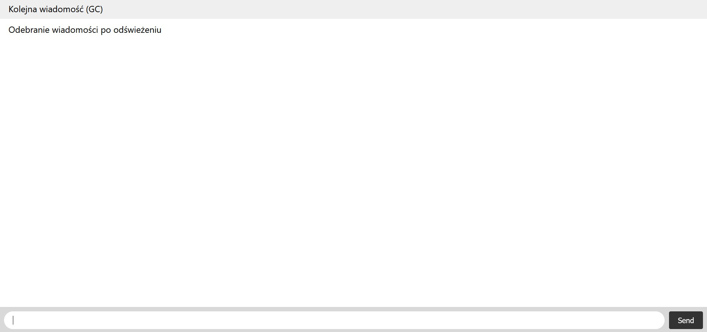

**8. Czat z użyciem django-channels + Web Workers**

* **part I:**
- szybkie wyjaśnienie idei WebSockets,
- więcej szczegółów na javascript.info,
- modułws z Node.js,
- czym jest WSGI?,
- od Django 3.0 możemy również korzystać z zalet ASGI (Asynchronous Server Gateway Interface),
- gdzie można korzystać z ASGI,
- przykład z wykorzystaniem socket.io do budowy czata

Widok strony głównej czatu - napisane wiadomości (przeglądarka Google Chrome)

Widok strony głównej czatu - napisane wiadomości (przeglądarka Mozilla Firefox)

Widok strony głównej czatu - napisane wiadomości po odswiezeniu strony w przeglądarce Mozilla Firefox (przeglądarka Google Chrome)

Widok strony głównej czatu - napisane wiadomości po odswiezeniu strony (przeglądarka Mozilla Firefox)

* **part II:**
- wyjaśnienie idei stosowania Web Workerów,
- praca z Web Worker’ami,
- należy zwrócić uwagę na typowe dla Workerów elementy: event listener onmessage i funkcję postMessae(),
- należy wdrożyć dwa Web Workery, z których każdy wykonuje “czasochłonne” obliczenia, np. obliczanie liczby ciągu Fibonnaciego.