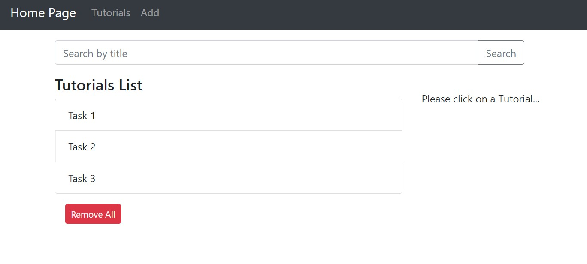
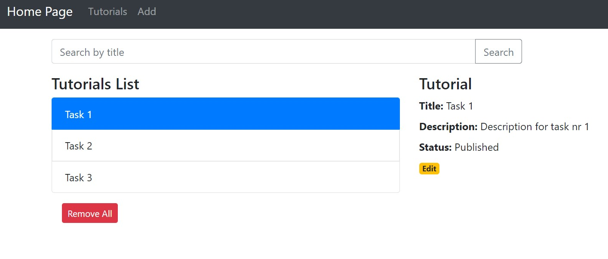
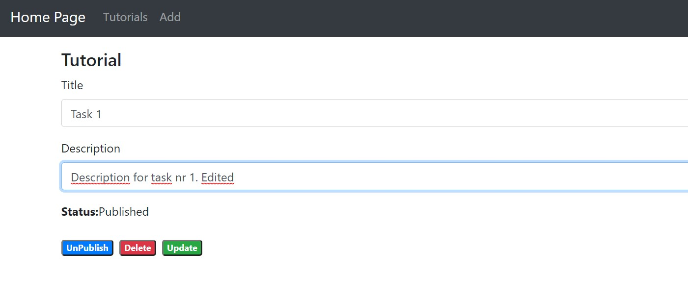
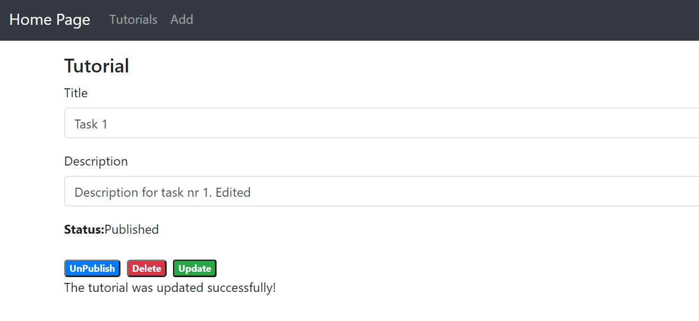
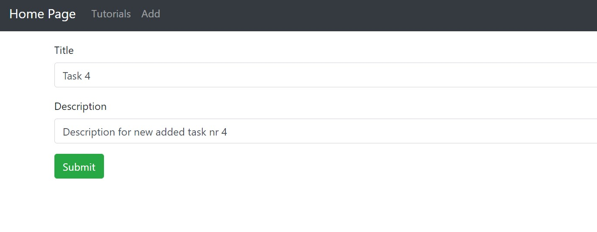
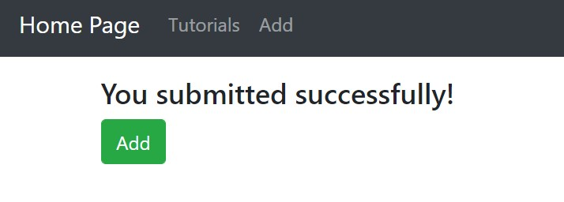
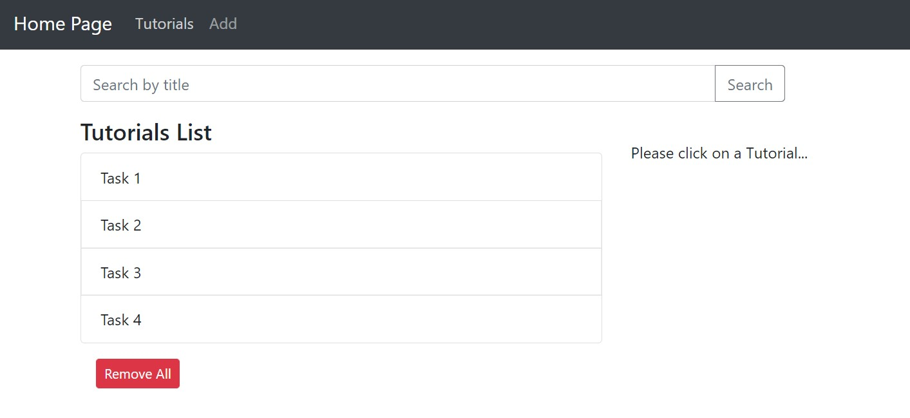
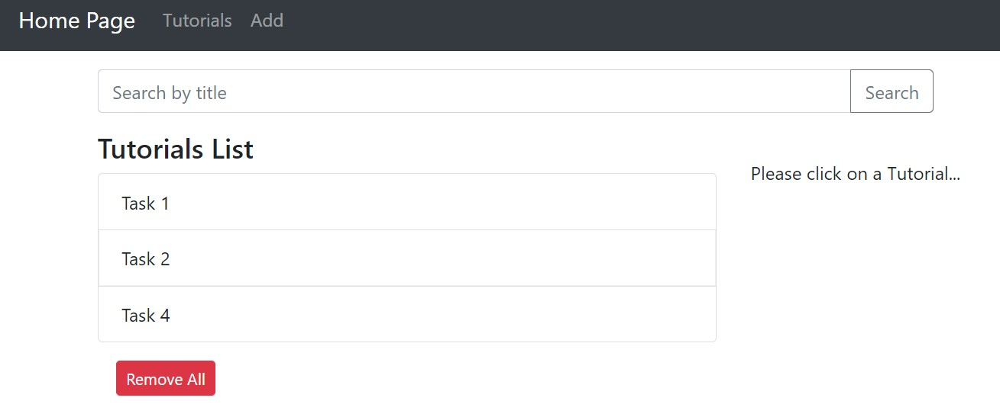

# Aplikacje-Internetowe-Soczynski-185IC

9. Django + React (aplikacja CRUD)
- backend napisany w Django,
- frontend napisany za pomocą React.js,
- biblioteka ‘axios’ użyta do “konsumowania” API wystawionego np. przez DRF,
- przykład aplikacji CRUD z wykorzystaniem Django i React’a,
- należy przeanalizować i wdrożyć kod z ww. poradnika,

Widok strony głównej 

Widok strony głównej z podglądem zadania

Widok strony do edycji zadania

Widok strony po zedytowaniu zadania

Widok strony głównej z podglądem zedytowanego zadania

Widok strony z dodawaniem zadania

Komunikat dodania zadania

Widok strony głównej po dodaniu zadania

Widok strony głównej po usunięciu zadania

To run app:
- 2 terminals (active myvenv)
- 1: npm start
- 2: python manage.py runserver 8080